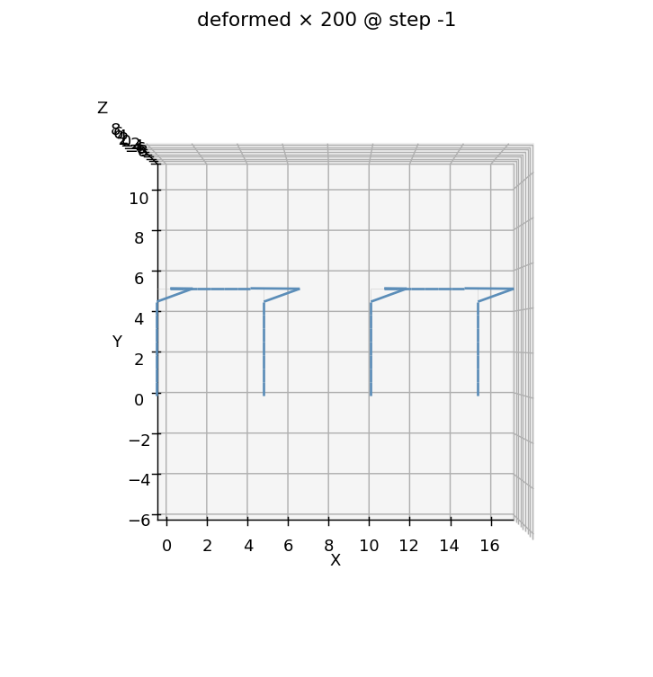

# E9 — Compose modules

Up to now every model was built in a *single* session: open `apeGmsh`,
draw the geometry, mesh, solve. That's the right shape for one structure.
But real buildings repeat — the same bay, the same column, the same
prefabricated unit, stamped out many times. You don't want to re-draw and
re-mesh it on every copy. You want to build the piece **once**, save it,
and place copies of it into a larger model.

That's **compose**. You save a meshed module, with its elements, to a
`model.h5`, then an `Assembly` places it as many times as you like —
tag-offset and namespaced, no re-meshing. In this example we build the
[portal frame](portal-frame.md) from E1 as a module, place it as **two
bays**, push each bay with the same 60 kN lateral load, and check that
**each bay drifts exactly the E1 amount, 8.39 mm** — because the assembly
leaves the bays *independent*. That self-consistency is the whole proof: a
placed copy behaves identically to the standalone original.

## The problem

```
   bay 1 ("bay1." prefix)            bay 2 ("bay2." prefix)
   P ──►●═══════════●                P ──►●═══════════●
        ║           ║                     ║           ║
        ║  columns  ║ beam                ║           ║   H = 5 m
        ║           ║                     ║           ║
      ██╨██       ██╨██                 ██╨██       ██╨██
      Fixed       Fixed                 Fixed       Fixed
      └──── 5 m ────┘   ← 10 m gap →    └──── 5 m ────┘

  Module: the E1 portal — columns 0.22×0.22, beam 0.20×0.50, steel E = 200 GPa
  Each bay: lateral P = 60 kN + gravity W = 300 kN at the roof joints
  Bays are 10 m apart and NOT tied → mechanically independent
```

What we expect, stated up front:

**Per-bay drift.** Each bay *is* the E1 portal, loaded exactly as in E1. So
each bay's roof should drift the **same 8.39 mm** E1 produced — and the two
bays should agree with each other to round-off. If composing changed the
physics, this is where it would show.

**Per-bay base shear.** Each bay's two column bases must between them react
that bay's 60 kN lateral load — `−60 000 N`, exactly. Two separate static
equilibrium checks, one per bay, both to the last digit.

!!! note "Units"
    Consistent SI throughout — metres, newtons, pascals. Drift comes out in
    metres; we print millimetres.

## The whole script

Read it once top to bottom, then we'll walk the three new moves: **save a
module**, **place it twice**, and **address each copy by its prefixed
name**.

```python
import tempfile, os
from apeGmsh import apeGmsh, Results
from apeGmsh.assembly import Assembly
from apeGmsh.opensees import apeSees, OpenSeesModel
from apeGmsh.results.capture.spec import DomainCaptureSpec

# --- Problem data (consistent SI: m, N, Pa) — the E1 portal ---
H, B, E = 5.0, 5.0, 200e9
bc, hc = 0.22, 0.22; Ac = bc * hc; Ic = bc * hc**3 / 12.0   # columns
bb, hb = 0.20, 0.50; Ab = bb * hb; Ib = bb * hb**3 / 12.0   # beam
P, W = 60_000.0, 300_000.0                                   # lateral + gravity

work     = tempfile.mkdtemp()
module   = os.path.join(work, "portal_module.h5")   # the reusable part
assembly = os.path.join(work, "two_bay.h5")         # the assembled model
run_h5   = os.path.join(work, "run.h5")             # the solved results

# --- 1. Build the portal MODULE once: mesh, groups and elements ---
with apeGmsh(model_name="portal_module") as g:
    bl = g.model.geometry.add_point(0.0, 0.0, 0.0)
    br = g.model.geometry.add_point(B,   0.0, 0.0)
    tl = g.model.geometry.add_point(0.0, H,   0.0)
    tr = g.model.geometry.add_point(B,   H,   0.0)
    col_l = g.model.geometry.add_line(bl, tl)
    col_r = g.model.geometry.add_line(br, tr)
    beam  = g.model.geometry.add_line(tl, tr)
    g.model.sync()

    g.physical.add(1, [col_l, col_r], name="Columns")
    g.physical.add(1, [beam],         name="Beam")
    g.physical.add(0, [bl, br],       name="Base")
    g.physical.add(0, [tl],           name="RoofL")
    g.physical.add(0, [tr],           name="RoofR")

    g.mesh.sizing.set_global_size(H / 6.0)
    g.mesh.generation.generate(1)
    fem = g.mesh.queries.get_fem_data(dim=None)

portal = apeSees(fem)
portal.model(ndm=2, ndf=3)
transf = portal.geomTransf.Linear()
portal.element.elasticBeamColumn(pg="Columns", transf=transf, A=Ac, E=E, Iz=Ic)
portal.element.elasticBeamColumn(pg="Beam",    transf=transf, A=Ab, E=E, Iz=Ib)
portal.h5(module)                 # the module: one reusable file

# --- 2. Place the module twice: bay 2 sits 10 m to the right ---
asm = Assembly("two_bay")
asm.instance("bay1", module)
asm.instance("bay2", module, translate=(10.0, 0.0, 0.0))
ops = asm.bridge(ndm=2, ndf=3)    # the elements arrive with each instance

# --- 3. Supports, loads and the analysis, on the bridge ---
for bay in ("bay1", "bay2"):
    ops.fix(pg=f"{bay}.Base", dofs=(1, 1, 1))

ts = ops.timeSeries.Linear()
with ops.pattern.Plain(series=ts) as pat:
    for bay in ("bay1", "bay2"):
        pat.load(pg=f"{bay}.RoofL", forces=(P / 2.0, -W / 2.0, 0.0))
        pat.load(pg=f"{bay}.RoofR", forces=(P / 2.0, -W / 2.0, 0.0))

ops.constraints.Plain()
ops.numberer.Plain()
ops.system.BandGeneral()
ops.test.NormDispIncr(tol=1e-10, max_iter=10)
ops.algorithm.Linear()
ops.integrator.LoadControl(dlam=1.0)
ops.analysis.Static()
asm.h5(assembly)                  # the assembled model.h5 + /assembly

# --- 4. Solve, capturing each bay's roof drift AND base reactions ---
spec = DomainCaptureSpec(opensees=ops)
for bay in ("bay1", "bay2"):
    spec.nodes(pg=f"{bay}.RoofL", components=["displacement"])
    spec.nodes(pg=f"{bay}.RoofR", components=["displacement"])
    spec.nodes(pg=f"{bay}.Base",  components=["reaction_force"])
with ops.domain_capture(spec, path=run_h5) as cap:
    cap.begin_stage("lateral", kind="static")
    ops.analyze(steps=1)
    cap.step(t=1.0)
    cap.end_stage()

# --- 5. Read each bay's drift back, by name ---
om = OpenSeesModel.from_h5(run_h5, fem_root="/model")
results = Results.from_native(run_h5, model=om)

def drift(bay):
    l = results.nodes.get(pg=f"{bay}.RoofL", component="displacement_x")
    r = results.nodes.get(pg=f"{bay}.RoofR", component="displacement_x")
    return 0.5 * (float(l.values[-1, 0]) + float(r.values[-1, 0]))

drift_bay1 = drift("bay1")
drift_bay2 = drift("bay2")

bx1 = results.nodes.get(pg="bay1.Base", component="reaction_force_x")
bx2 = results.nodes.get(pg="bay2.Base", component="reaction_force_x")

print(f"bay 1 drift      = {drift_bay1*1e3:.4f} mm")
print(f"bay 2 drift      = {drift_bay2*1e3:.4f} mm")
print(f"E1 standalone    = 8.3883 mm")
print(f"bay1 vs bay2     = {abs(drift_bay1-drift_bay2)*1e3:.2e} mm")
print(f"bay 1 base shear = {float(bx1.values[-1, :].sum()):.1f} N")
print(f"bay 2 base shear = {float(bx2.values[-1, :].sum()):.1f} N")
```

Run it. You should see:

```
bay 1 drift      = 8.3883 mm
bay 2 drift      = 8.3883 mm
E1 standalone    = 8.3883 mm
bay1 vs bay2     = 6.83e-12 mm
bay 1 base shear = -60000.0 N
bay 2 base shear = -60000.0 N
```

**Both bays drift 8.3883 mm — the exact E1 number — and agree with each
other to 1e-11 mm.** Each base shear is `−60 000 N` to the last digit. The
placed copies are mechanically *indistinguishable* from the standalone
portal. That's compose doing its job: it relocates and renames a module
without perturbing a single stiffness term.

## Step 1 — Save a module with `ops.h5`

```python
portal = apeSees(fem)
portal.model(ndm=2, ndf=3)
transf = portal.geomTransf.Linear()
portal.element.elasticBeamColumn(pg="Columns", transf=transf, A=Ac, E=E, Iz=Ic)
portal.element.elasticBeamColumn(pg="Beam",    transf=transf, A=Ab, E=E, Iz=Ib)
portal.h5(module)
```

The geometry and mesh are E1's. What's new is where the session ends: the
meshed model goes to a bridge, the bridge gets the dimensions and the
elements, and **`portal.h5(module)`** writes it all — nodes, elements,
physical groups, the transform and the element specs — to a native
`model.h5`. That file *is* the module: a self-contained, reusable part you
can place any number of times, in this script or a different one next week.

Two things make a file a module. It must carry its model dimensions —
`ops.model(ndm=2, ndf=3)` — because the assembly checks them; a plain
`g.save()` file has none, and placing it is refused. And whatever it
declares on its groups travels with every copy: the columns and the beam
are declared **once**, here, and both bays get them. That's the "build
once" story all the way down to the element properties.

Every PG name you'll want to address later — `"Columns"`, `"Base"`,
`"RoofL"` — gets named here, exactly as in E1.

## Step 2 — Place the module twice

```python
asm = Assembly("two_bay")
asm.instance("bay1", module)
asm.instance("bay2", module, translate=(10.0, 0.0, 0.0))
ops = asm.bridge(ndm=2, ndf=3)
```

Three new calls.

**`Assembly("two_bay")`** starts an empty assembly. It draws nothing and
meshes nothing; it only records where each file goes.

**`asm.instance(label, module, ...)`** places one copy of the file. The
label is the copy's **namespace prefix**: every physical group the module
carries comes in renamed `"{label}.{pg}"` — so the first bay's columns are
`"bay1.Columns"`, the second bay's base is `"bay2.Base"`, and so on. Every
instance is namespaced the same way; there is no privileged first copy
with bare names. `translate=` rigidly shifts the copy; there's also
`rotate=((ax, ay, az), theta)`, applied before the shift, and `anchor=`,
which places a copy at a port of an earlier instance.

**`asm.bridge(ndm=2, ndf=3)`** merges the instances into one model and
hands back an ordinary `apeSees` bridge, with each module's elements
already declared on its prefixed groups. From here on it is the bridge
you've used since E1.

If you want to see what's inside a module *before* placing it,
`apeGmsh.from_h5(module).compose_inspect(module)["pg_inventory"]` returns its
physical-group names without merging anything — here
`('Base', 'Beam', 'Columns', 'RoofL', 'RoofR')`.

!!! warning "Compose does not weld coincident nodes"
    Placing an instance is a **graft, not a merge**. If two instances happen
    to share a coordinate at an interface, they keep **two separate
    nodes** — the copies stay mechanically independent unless you
    explicitly tie them. In this example that independence is exactly what
    we *want* (the bays are 10 m apart and uncoupled). To actually *connect*
    adjacent copies — share a column line, bolt a bay to its neighbour — you
    declare the join on the assembly before bridging, e.g.
    `asm.tie("bay1.face", "bay2.face")` or
    `asm.equal_dof("bay1.joint", "bay2.joint", dofs=[1, 2, 3])`. That's a
    separate move; `instance` never couples anything.

## Step 3 — Address each copy by its namespaced name

```python
for bay in ("bay1", "bay2"):
    ops.fix(pg=f"{bay}.Base", dofs=(1, 1, 1))
    ...
        pat.load(pg=f"{bay}.RoofL", forces=(P / 2.0, -W / 2.0, 0.0))
```

This is the payoff of the namespacing. The two bays are *the same module*,
so they'd have name-collided if the assembly hadn't prefixed them. Because
every copy is prefixed, every selector stays unambiguous: `pg="bay1.Base"`
is bay 1's base, `pg="bay2.Base"` is bay 2's. You declare each bay's
fixities and loads with the **same names you'd use for a standalone
portal**, just with the instance label in front — which is why a loop over
the labels does it all.

Supports, loads and the analysis are declared **here, on the bridge**, not
in the module. A module carries its model — mesh, groups, elements; the
assembly decides how the whole thing is held and pushed. (The bridge
auto-emits MP constraints, while `g.loads` cases are opt-in — import each
into a `Plain` pattern with `p.from_model("<case>")`; fixities are declared
explicitly here.)

`asm.h5(assembly)` then writes the assembled model: the same `model.h5`
the bridge's own `ops.h5` writes, plus an `/assembly` zone that lists the
instances. `apeGmsh.from_h5(assembly).compose_list()` reads it back —
one record per bay, with its source file and its `translate`.

## Step 4 — Read each bay back, by name

```python
def drift(bay):
    l = results.nodes.get(pg=f"{bay}.RoofL", component="displacement_x")
    r = results.nodes.get(pg=f"{bay}.RoofR", component="displacement_x")
    return 0.5 * (float(l.values[-1, 0]) + float(r.values[-1, 0]))

drift_bay1 = drift("bay1")
drift_bay2 = drift("bay2")
```

The read side is the same `results.nodes.get(pg=..., component=...)` you've
used since E1 — `Results.from_native(..., model=...)` with `model=`
required, reading the model out of the same run file. The *only*
difference is which name you ask for: the instance label in front of the
group. One helper, two labels, two bays.

## See it

The deformed shape makes the independence obvious. We render it headless
(matplotlib, no GPU) and look straight down the out-of-plane axis:

```python
ax = results.plot.deformed(step=-1, scale=200)
ax.view_init(elev=90, azim=-90)     # look down +z -> 2-D elevation
ax.figure.savefig("compose-two-bay.png", dpi=130, bbox_inches="tight")
```



Two portals, 10 m apart, each leaning right by the same amount — the E1 sway
mode, stamped twice. Nothing crosses the gap: the bays deform as if the other
weren't there, which is precisely why each drift lands on 8.39 mm.

For an interactive 3-D view in a notebook, reach for
**`results.show_web()`** — the kernel-safe web viewer. (Never call
`results.viewer()` in a notebook; its blocking VTK+Qt loop crashes the
kernel.) The composed viewer can even colour by source module
(`set_mode('Module')`) so each bay gets its own hue.

## What you just learned

- **Build once, save, reuse.** A bridge with `ops.model(ndm=..., ndf=...)`
  and its element specs, written with `ops.h5(path)`, is a reusable
  **module**. A plain `g.save()` file is not: it has no model dimensions.
- **`Assembly` + `instance` + `bridge`.** Place each copy with
  `asm.instance(label, module, translate=...)`, then `asm.bridge(...)`
  merges them, tag-offset and renamed, with their elements. No re-meshing.
- **Every instance is label-prefixed.** Each copy's groups are
  `"{label}.{pg}"` (`"bay1.Columns"`, `"bay2.Columns"`). Address every part
  by that name from there on.
- **Compose grafts, it doesn't weld.** Coincident nodes of different
  instances stay *separate* — copies are independent until you join them on
  the assembly (`tie` / `equal_dof` / `rigid_link` / `embedded`).
- **The model travels, the analysis doesn't.** Elements come with each
  instance; supports, loads and the analysis are declared on the bridge.
- **Proof, not promise.** Each bay drifts the exact E1 8.3883 mm and reacts
  its full 60 kN base shear — a placed copy is mechanically identical to
  the standalone original, to round-off.

## Where next

- **[Portal frame](portal-frame.md)** — the E1 module this page stamps twice,
  if you want the walkthrough behind the 8.39 mm.
- **[Assemble saved models](../how-to/assemble-saved-models.md)** — the
  full `Assembly` recipe: rotation, ties, couplings, reference nodes and
  one MPI rank per instance.
- **[Multi-part assembly](multipart-assembly.md)** — the *in-session* way to
  reuse a member: build a column as a `Part` and stamp it with `g.parts.add`
  (one gmsh kernel), versus the assembly's cross-session `model.h5` placing.
- **[Tie non-matching meshes](tie-non-matching-meshes.md)** — when modules
  *should* connect: the interface constraint that the assembly deliberately
  leaves to you.

---

*Next: [E10 — Pushover of a steel moment frame (fiber sections)](pushover-steel-frame.md).*
